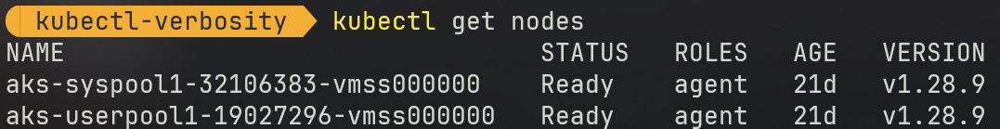
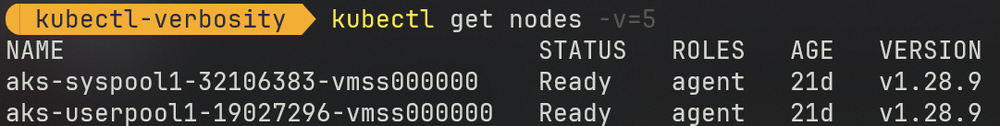

# kubectl verbosity levels

## Overview

As I was getting deeper in [AKS](https://docs.microsoft.com/en-us/azure/aks/) and [kubectl](https://kubernetes.io/docs/reference/kubectl/overview/), I found myself in need of a way to increase the verbosity of the output of `kubectl` commands.

I wanted to see more details about what was happening under the hood.
I did that to be able to have a full control of the Kubernetes API calls to setup some tools that would interact directly with the API.

That's my default output (see here for setup details):



## Getting verbosity

To get some verbosity from kubectl is pretty simple. You just need to add the `-v=<level>` flag to the command you are running.

### Example

- Command:

```bash
kubectl get node -v=6
```

- Result:


## Verbosity levels

### Levels <6

Commands with these levels don't output anything more than without the verbosity flag.

They may do with errors and warnings, but I haven't seen any yet.

- Command:

```bash
kubectl get node -v=[1..5]
```

- Result:



- Comment:

  - No difference from the default output

### Level 6

We start to see interesting things at this level.

- Command:

```bash
kubectl get node -v=6
```

- Result:


- Comment:

  - Now we see interesting things:

    - Which `kubeconfig` file is used
    - what RESTful `Kubernetes API` call is being made
    - the duration it took to execute the steps

  - That would be my default verbosity level for debugging purposes and to build web API queries on my own from a .NET `HttpClient`, a `REST http client` or a `curl` command.

## References

[Kubernetes API Concepts](https://kubernetes.io/docs/reference/using-api/api-concepts/)

[Command line tool: `kubectl`](https://kubernetes.io/docs/reference/kubectl/)

[Other tools](https://kubernetes.io/docs/reference/tools/)

[Kubernetes Client Libraries](https://kubernetes.io/docs/reference/using-api/client-libraries/)

[Getting a Bearer token for AKS: use `kubelogin`](https://github.com/Azure/kubelogin)

[Use `Exec Plugin` with `kubelogin` to connect to AKS](https://azure.github.io/kubelogin/concepts/exec-plugin.html)
