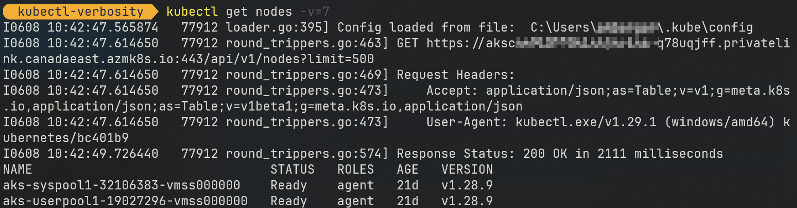

# kubectl verbosity levels

## Overview

As I was getting deeper in [AKS](https://docs.microsoft.com/en-us/azure/aks/) and [kubectl](https://kubernetes.io/docs/reference/kubectl/overview/), I found myself in need of a way to increase the verbosity of the output of `kubectl` commands.

I wanted to see more details about what was happening under the hood.
I did that to be able to have a full control of the Kubernetes API calls to setup some tools that would interact directly with the API.

That's my default output (see here for setup details):


## Getting verbosity

To get some verbosity from kubectl is pretty simple. You just need to add the `-v=<level>` flag to the command you are running.

### Example

- Command:

```bash
kubectl get node -v=6
```

- Result:


## Verbosity levels

### Summary

Level | Recommended | Adding from | Adding
------|---------|----------|---------
`1..5` | | N/A | N/A
`6` | Yes | N/A | <ul><li>`kubeconfig` file</li><li>RESTful `Kubernetes API` call</li><li>response and duration</li></ul>
`7` | | 6 | <ul><li>`Request Headers`</li><li>`Response Status` as dedicated line</li></ul>
`8` | Yes | 7 | <ul><li>`Response Headers`</li><li>truncated `Response Body`</li></ul>
`9` | Yes| 6 | <ul><li>`curl` command</li><li>`HTTP Trace` on DNS resolution and Dial tcp result</li><li>`HTTP statistics` for durations</li><li>`Response Headers`</li><li>full `Response Body`</li></ul>
`10` |  | 9 | <ul><li>`cached discovery`</li></ul>

### Details

#### Levels <6

Commands with these levels don't output anything more than without the verbosity flag.

They may do with errors and warnings, but I haven't seen any yet.

- Command:

```bash
kubectl get node -v=[1..5]
```

- Result:


- Comment:

  - No difference from the default output

#### Level 6

We start to see interesting things at this level.

- Command:

```bash
kubectl get node -v=6
```

- Result:


- Comment:

  - Now we see interesting things:

    - Which `kubeconfig` file is used
    - what RESTful `Kubernetes API` call is being made with its response and duration

  - That would be my default verbosity level for debugging purposes and to build RESTful web API queries on my own from a .NET `HttpClient`, a `REST http client` or a `curl` command.

#### Level 7

- Command:

```bash
kubectl get node -v=7
```

- Result:



- Comment:

  - Same details than **level 6**
  - With addition of:
    - `Request Headers`
    - `Response Status` as dedicated line

#### Level 8

- Command:

```bash
kubectl get node -v=8
```

- Result:


- Comment:

  - Same details than **level 7**
  - With addition of:
    - `Response Headers`
    - Truncated `Response Body`

#### Level 9

- Command:

```bash
kubectl get node -v=9
```

- Result:


- Comment:

  - Same details than **level 6** (not 7 or 8)
  - With addition of:
    - `curl` command
    - `HTTP Trace` on DNS resolution and Dial tcp result
    - `HTTP statistics` for durations
    - `Response Headers`
    - Full `Response Body`

#### Level 10

- Command:

```bash
kubectl get node -v=10
```

- Result:


- Comment:

  - Same details than **level 9**
  - With addition of:
    - `cached discovery`

#### Levels >10

I didn't find differences between levels 10 and >10.

## Conclusion

I hope this would help, as I couldn't find any documentation on the subject.

## References

[Kubernetes API Concepts](https://kubernetes.io/docs/reference/using-api/api-concepts/)

[Command line tool: `kubectl`](https://kubernetes.io/docs/reference/kubectl/)

[`kubectl` source code](https://github.com/kubernetes/kubectl)

[Other Kubernetes tools](https://kubernetes.io/docs/reference/tools/)

[Kubernetes Client Libraries](https://kubernetes.io/docs/reference/using-api/client-libraries/)

[Getting a Bearer token for AKS: use `kubelogin`](https://github.com/Azure/kubelogin)

[Use `Exec Plugin` with `kubelogin` to connect to AKS](https://azure.github.io/kubelogin/concepts/exec-plugin.html)

## My machine setup

The machine used for this article has these relevant software components installed:

- `Windows 11 Pro x64`
- `kubectl for Windows` version: `v1.29.1`, installed with `choco install kubernetes-cli`
- `kubelogin` version: `git hash: v0.1.0/0fcd072d45250a50cde855cf50204ad2dc784095`, installed with `az aks install-cli`
- `PowerShell Core` version: `7.4.2`
- PowerShell [`oh-my-posh`](https://ohmyposh.dev/docs/installation/windows) with theme: `Paradox`

## The AKS cluster

- Kubernetes version: `1.28.9`
- Private cluster: `Enabled`
